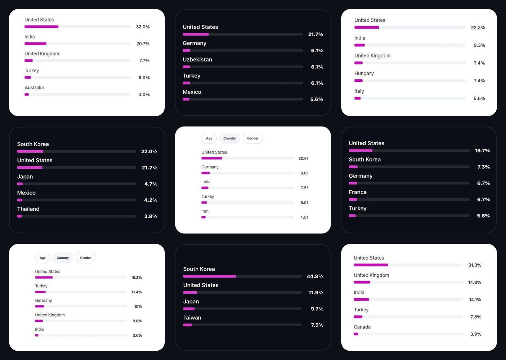
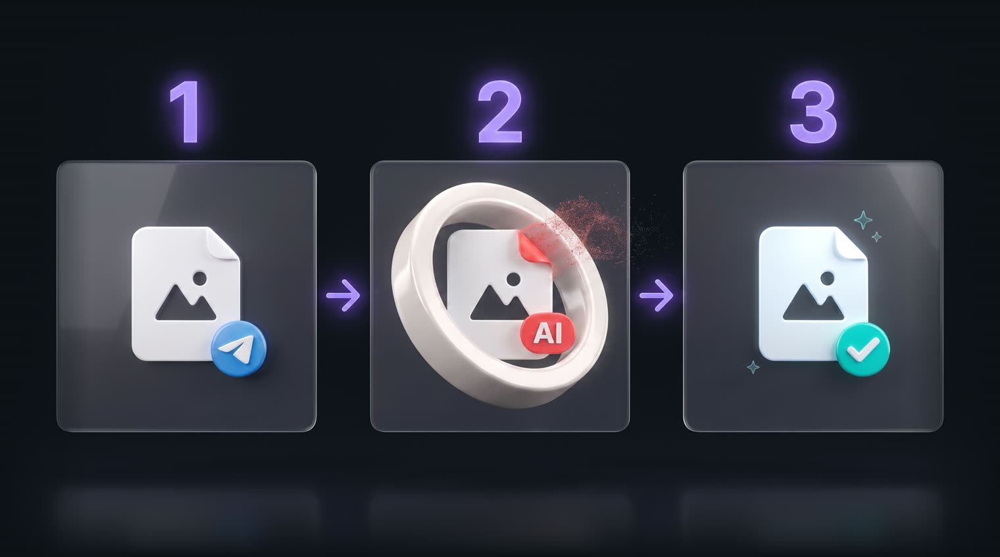
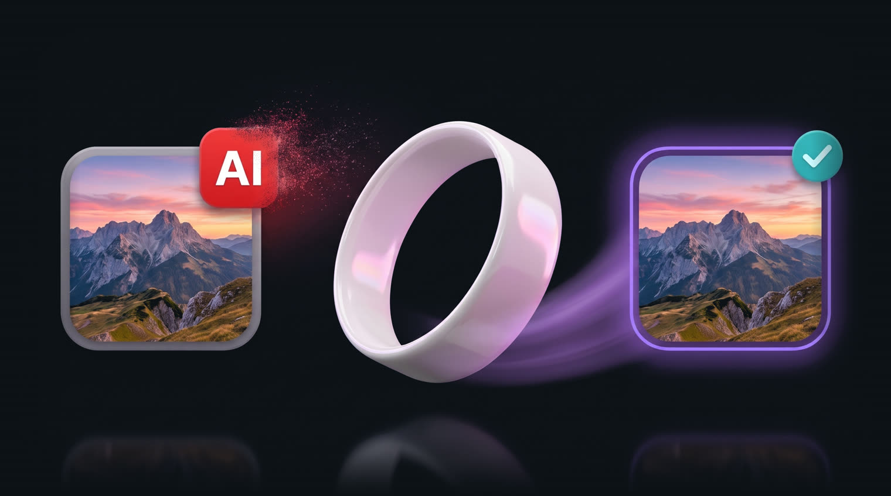
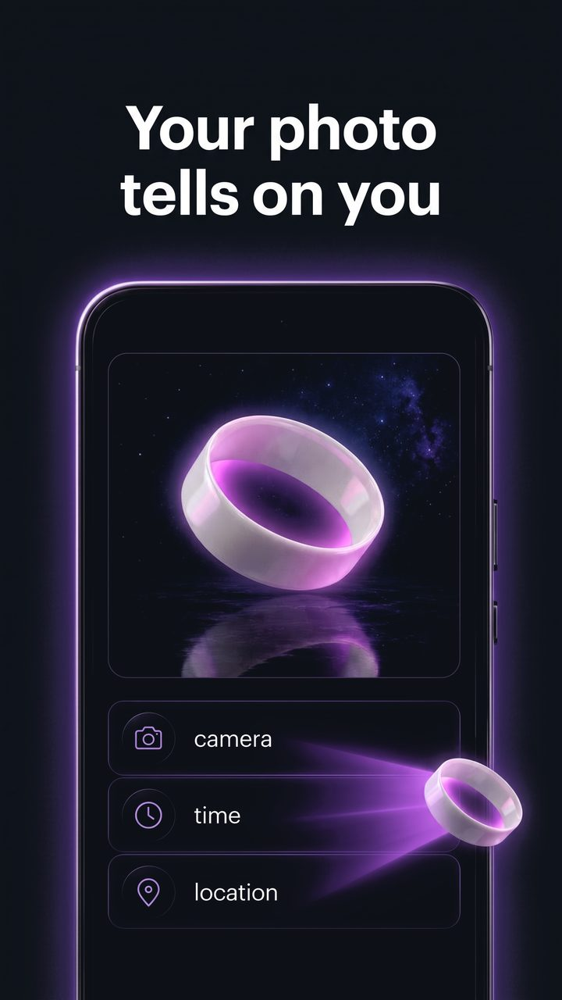
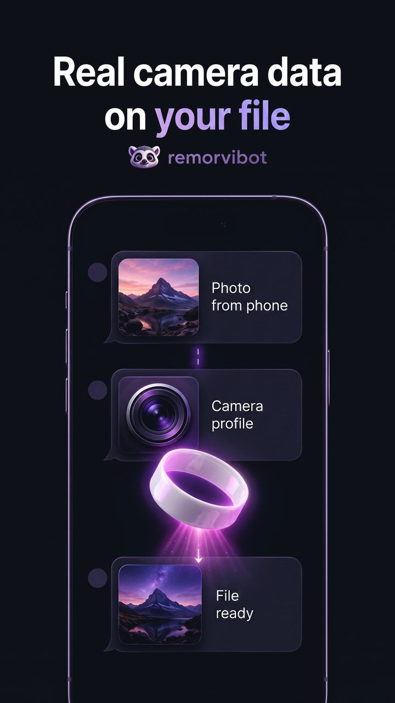
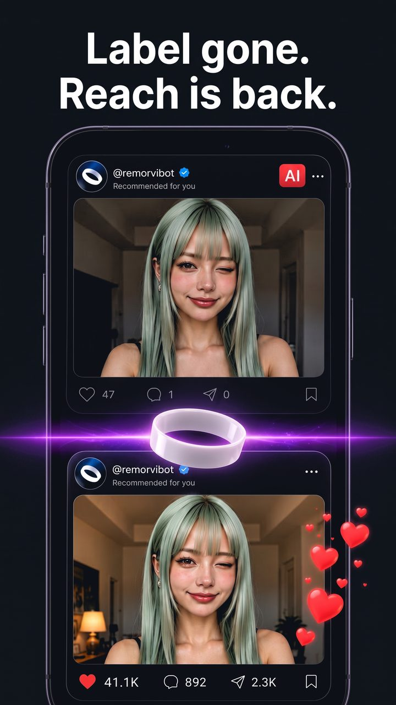
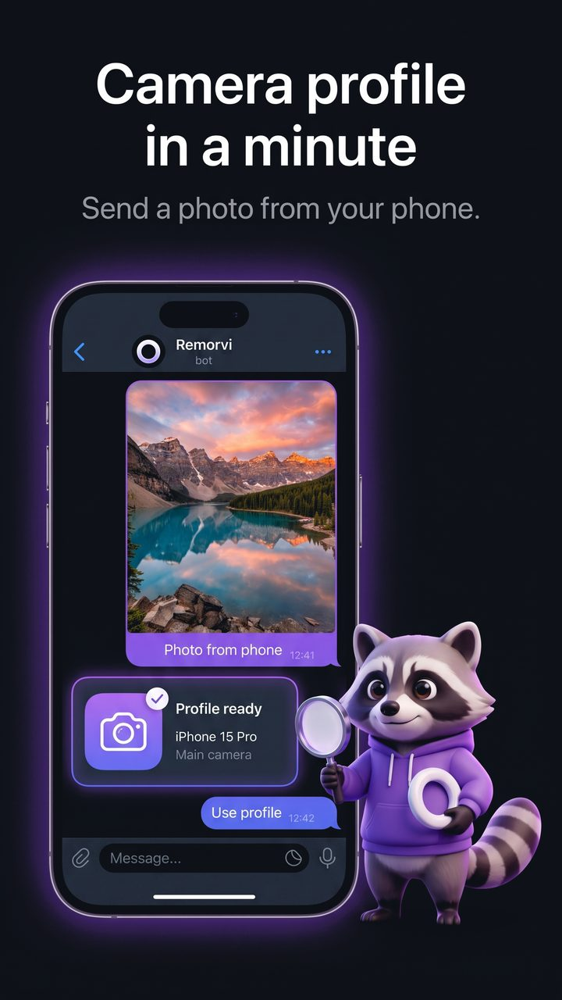
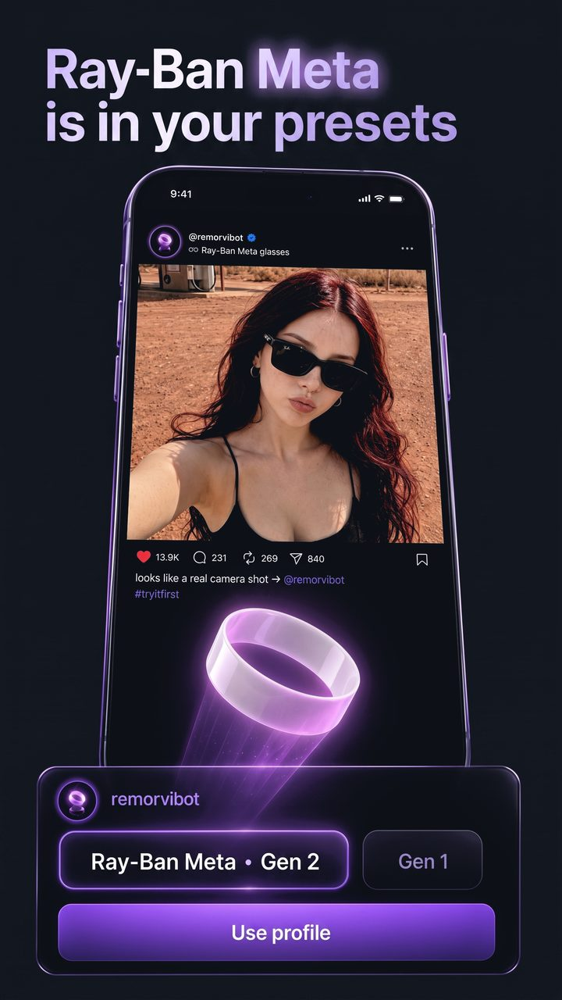

> [!TIP]
> Try it now: [**@remorvibot**](https://t.me/remorvibot?start=gh_tip_en) – 3 days of **Unlimited** free.

### An AI photo or video – like it was shot on a real phone

**Any location, time and real camera data. No AI traces or suspicious metadata**

&nbsp;

**[→ Open @remorvibot](https://t.me/remorvibot?start=gh_readme_en)** · [Русский](README.ru.md)

---

## Reviews

> “I used to get the label on this kind of content all the time. After processing in Remorvi, my second video already goes out without a label. Still watching the reach, but just the fact that the badge stopped showing up already makes me happy.”
> – **Calm Cat**

> “Uploaded a photo to Instagram while sitting on mobile internet in Ukraine. Set the post geo to the US because I picked Florida in the bot – Instagram read it just fine and even showed I was about 0.5 km from the location. Looks very realistic.”
> – **Clever Fox**

> “Uploaded 9 videos in a row like this – you can see the geo on the screenshots. It really helped me set up the audience geo on two different accounts: on the fresh one the audience went to the US and Korea from the very first video.”
> – **Playful Dog**

Reviews from our Telegram community – the geo is right there in their screenshots.

## What it is

**remorvi** gets AI photos and videos ready to post. Every generated file carries traces in its metadata, and platforms read them the moment you hit upload. Instagram and TikTok slap on a permanent “AI-made” label, and then comes the shadow: reach gets cut, views hit the 200–300 ceiling, sometimes an outright ban. **remorvi** strips the traces and applies real camera data – a phone model and 200+ parameters from your device, or one of 30+ presets (iPhone, Samsung, Ray-Ban Meta). Platforms fully trust content processed through **remorvi**: no “AI-made” labels, reach isn’t cut, posts sail straight into recommendations – no shadow zone, no bans.

## How it works

1. **Send a file** – a photo or video as a file, no compression.
2. **We take the traces off** – strip AI markers and service data, apply a real camera profile, set the place and time you want.
3. **Done** – the file looks shot on a phone, quality untouched.

You send a file to the bot → processing → you get it back → the file is deleted from the server. We store nothing.

## What platforms find in an untouched file

| Trace in the file | Instagram | Threads | TikTok | YouTube | X |
|---|:---:|:---:|:---:|:---:|:---:|
| **Hidden AI signature** the file itself reports it’s AI-made | 🔴 | 🔴 | 🔴 | 🔴 | 🟡 |
| **“AI-made” tag** left behind by neural nets and photo editors | 🔴 | 🔴 | 🔴 | 🟡 | 🟡 |
| **Generator name in file info** Midjourney, Sora, Gemini/Nano Banana, GPT, Kling, Seedance… | 🟡 | 🟡 | 🟡 | 🟡 | 🟢 |
| **Geo and serial of the original file** photo editors leave them in place – the platform reads them first | 🟢 | 🟢 | 🟢 | 🟢 | 🟢 |
| **A file with no camera data at all** what online cleaners and screenshots leave behind | 🟡 | 🟡 | 🟡 | 🟡 | 🟢 |
| **Your file after remorvi** real camera data, no traces left | ✅ | ✅ | ✅ | ✅ | ✅ |

🔴 a permanent “AI-made” label everyone sees – then the shadow zone or a ban 
🟡 may get flagged as AI or have its reach cut – the classic 200–300 view ceiling 
🟢 no label for this – but the platform reads and remembers this data before wiping it from the public copy: what it sees in there matters 
✅ after **remorvi** processing the file reads like a live phone shot – no label, no shadow zone, no view limits

> **remorvi** removes everything suspicious the algorithms won’t let through – hidden AI markers (C2PA, EXIF, IPTC) and the generator’s fingerprints in the file info – and applies real camera data: phone model, time, location. To the platform it’s ordinary content from a phone – content it can trust.

## What it does

<table>
  <tr><td>📸&nbsp;<b>Real&nbsp;camera&nbsp;data</b></td><td>phone model and 200+ unique parameters – your own device profile or 30+ presets (iPhone, Samsung, Ray-Ban Meta)</td></tr>
  <tr><td>✅&nbsp;<b>No&nbsp;AI&nbsp;traces</b></td><td>AI markers and suspicious metadata are gone – platforms have nothing to flag</td></tr>
  <tr><td>🎞&nbsp;<b>Photo&nbsp;and&nbsp;video</b></td><td>JPEG, PNG, HEIC, MP4, MOV – no re-encoding, quality stays</td></tr>
  <tr><td>📍&nbsp;<b>Any&nbsp;place&nbsp;and&nbsp;time</b></td><td>content reads like it was shot wherever you want</td></tr>
  <tr><td>📦&nbsp;<b>Batch</b></td><td>up to 20 files of any size at once</td></tr>
  <tr><td>🌍&nbsp;<b>RU&nbsp;/&nbsp;EN</b></td><td>the bot speaks both</td></tr>
</table>

## In slides

<!-- live snapshot 2026-07-10 · refresh via snapshot_social_proof_vitrina.py -->
**8,400+** people have processed **38,235** files with **remorvi**

## Try it

**[→ @remorvibot](https://t.me/remorvibot?start=gh_readme_cta_en)**

3 days of Unlimited free

## What’s next – roadmap

What we’re building:

- 🔜 **Check right in the browser** – see what platforms will find in your file before you post; the file stays on your device
- 🔜 **Open library** – the engine that finds AI traces in a file (MIT)
- 🔜 **Open platform rules** – a table: what earns an “AI-made” label, a shadow zone, cut reach or a ban

## Community

Questions and discussion → [Discussions](../../discussions)

<b>remorvi</b> · photos and videos that look shot on a real phone · <a href="https://t.me/remorvibot?start=gh_footer_en">@remorvibot</a>

