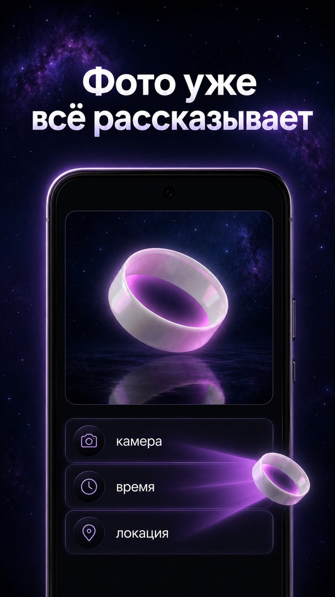
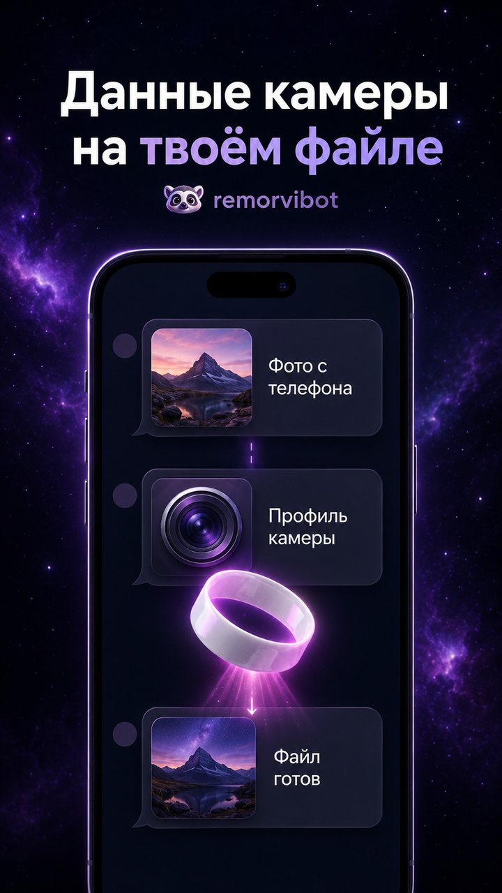
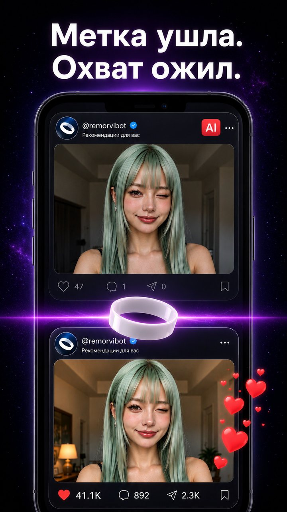
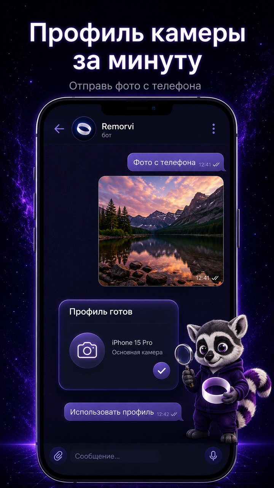
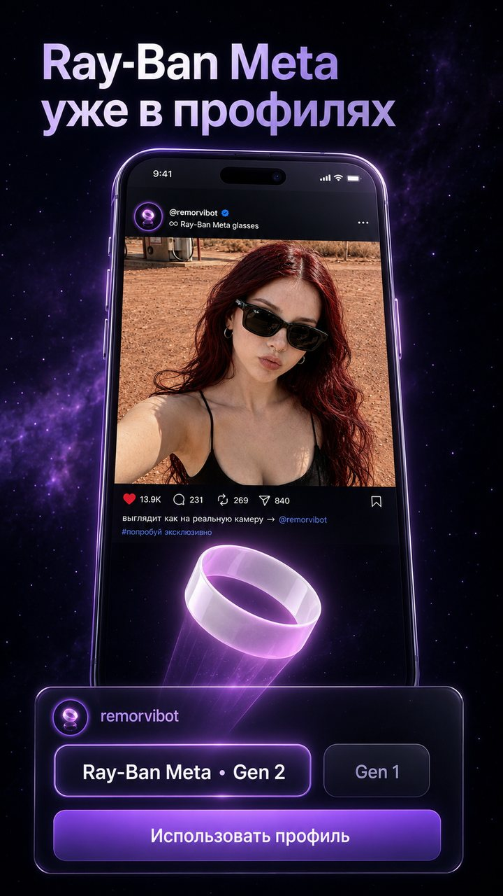

> [!TIP]
> Попробуй прямо сейчас: [**@remorvibot**](https://t.me/remorvibot?start=gh_tip_ru) – 3 дня **Unlimited** бесплатно.

### Фото или видео из нейросети – как снятое на реальный телефон

**Любая локация, время и данные реальной камеры. Без ИИ-следов и подозрительных метаданных**

&nbsp;

**[→ Открыть @remorvibot](https://t.me/remorvibot?start=gh_readme_ru)** · [Сайт-лендинг](https://willowite.github.io/remorvi/) · [English](README.md)

---

## Отзывы

> «Раньше на таком контенте постоянно ловил плашку. После обработки в Remorvi уже второе видео выходит без метки. По охватам пока ещё смотрю, но уже сам факт, что плашка больше не вылезает, очень радует.»
> – **Спокойный кот**

> «Залил фото в Instagram, хотя сам сижу с мобильного интернета Украины. В посте поставил гео США, потому что в боте выбрал Флориду, и Instagram нормально это считал – даже показал, что до локации около 0,5 км. Выглядит очень реалистично.»
> – **Находчивый лис**

> «Залил так 9 видосов подряд – гео видите на скринах. Хорошо помогло в настройке гео на двух разных аккаунтах: на новом с первого видоса аудитория пошла на Америку и Корею.»
> – **Шаловливый пёс**

Отзывы из нашего Telegram-сообщества – гео на скринах их аудитории.

## Что это

**remorvi** готовит ИИ-фото и видео к публикации. Каждый сгенерированный файл несёт следы в метаданных – платформы читают их в момент загрузки. Instagram и TikTok вешают несъёмную метку «Создано ИИ», а дальше тень: охваты режутся, просмотры упираются в потолок 200–300, а то и бан. **remorvi** убирает следы и переносит данные реальной камеры – модель телефона и 200+ параметров с твоего устройства или из 30+ пресетов (iPhone, Samsung, Ray-Ban Meta). Соцсети полностью доверяют контенту после обработки через **remorvi**: никаких меток «Создано ИИ», охваты не режутся, контент спокойно идёт в рекомендации – без тени и бана.

## Как это работает

1. **Отправь файл** – фото или видео как файл, без сжатия.
2. **Забираем следы** – снимаем ИИ-метки и служебные данные, переносим профиль реальной камеры, ставим нужное место и время.
3. **Готово** – файл как снятый на телефон, качество не тронуто.

Ты отправил файл в бота → обработка → получил обратно → с сервера файл удалён. Ничего не храним.

## Что соцсети находят в необработанном файле

| След в файле | Instagram | Threads | TikTok | YouTube | X |
|---|:---:|:---:|:---:|:---:|:---:|
| **Скрытая подпись нейросети** файл сам сообщает, что сделан ИИ | 🔴 | 🔴 | 🔴 | 🔴 | 🟡 |
| **Ярлык «создано ИИ»** оставляют нейронки и фоторедакторы | 🔴 | 🔴 | 🔴 | 🟡 | 🟡 |
| **Имя нейросети в свойствах** Midjourney, Sora, Gemini/Nano Banana, GPT, Kling, Seedance… | 🟡 | 🟡 | 🟡 | 🟡 | 🟢 |
| **Гео и серийник исходного файла** остаются после фоторедакторов – соцсеть читает их первой | 🟢 | 🟢 | 🟢 | 🟢 | 🟢 |
| **Файл совсем без данных камеры** так выглядят файлы после онлайн-чистилок и скриншоты | 🟡 | 🟡 | 🟡 | 🟡 | 🟢 |
| **Файл после remorvi** данные реальной камеры, следов не остаётся | ✅ | ✅ | ✅ | ✅ | ✅ |

🔴 повесят несъёмную метку «Создано ИИ» – её видят все, а дальше тень или бан 
🟡 могут пометить как ИИ или срезать охваты – тот самый потолок в 200–300 просмотров 
🟢 метку за это не повесят – но соцсеть прочитает и запомнит эти данные раньше, чем вычистит их из публичной копии – важно, что именно она там увидит 
✅ после обработки в **remorvi** файл выглядит как живая съёмка на телефон – ни метки, ни тени, ни ограничений по просмотрам

> **remorvi** убирает всё подозрительное, что не пропускают алгоритмы – скрытые ИИ-маркеры (C2PA, EXIF, IPTC) и следы нейронки в свойствах файла, – и переносит данные реальной камеры: модель телефона, время, локацию. Для платформы это обычный контент с телефона, которому можно доверять.

## Что умеет

<table>
  <tr><td>📸&nbsp;<b>Данные&nbsp;реальной&nbsp;камеры</b></td><td>модель телефона и 200+ уникальных параметров – свой профиль устройства или 30+ пресетов (iPhone, Samsung, Ray-Ban Meta)</td></tr>
  <tr><td>✅&nbsp;<b>Ни&nbsp;следа&nbsp;нейросети</b></td><td>ИИ-метки и подозрительные метаданные убраны – платформам нечего пометить</td></tr>
  <tr><td>🎞&nbsp;<b>Фото&nbsp;и&nbsp;видео</b></td><td>JPEG, PNG, HEIC, MP4, MOV – без пережатия, качество не тронуто</td></tr>
  <tr><td>📍&nbsp;<b>Любая&nbsp;локация&nbsp;и&nbsp;время</b></td><td>контент будто снят там, где захочешь</td></tr>
  <tr><td>📦&nbsp;<b>Массовая&nbsp;обработка</b></td><td>до 20 файлов любого размера сразу</td></tr>
  <tr><td>🌍&nbsp;<b>RU&nbsp;/&nbsp;EN</b></td><td>бот говорит на двух языках</td></tr>
</table>

## Коротко в слайдах

<!-- live-снапшот 10.07.2026 · обновлять скриптом snapshot_social_proof_vitrina.py -->
**8&#8239;400+** человек обработали **38&#8239;235** файлов через **remorvi**

## Попробовать

**[→ @remorvibot](https://t.me/remorvibot?start=gh_readme_cta_ru)**

3 дня Unlimited бесплатно

## Что дальше – роадмап

Над чем работаем:

- 🔜 **Проверка прямо в браузере** – увидишь, что соцсети найдут в файле, ещё до публикации; файл остаётся на твоём устройстве
- 🔜 **Открытая библиотека** – движок, который находит ИИ-следы в файле (MIT)
- 🔜 **Открытые правила платформ** – таблица: за что повесят метку «Создано ИИ», отправят в тень, урежут охваты или забанят

## Сообщество

Вопросы и обсуждение → [Discussions](../../discussions)

<b>remorvi</b> · фото и видео как снятые на реальный телефон · <a href="https://t.me/remorvibot?start=gh_footer_ru">@remorvibot</a>

